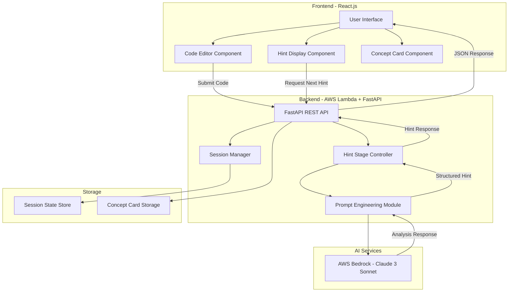

# Design Document: Kod-Guru

## Overview

Kod-Guru is a web-based Socratic debugging assistant that helps students learn debugging skills through guided questioning rather than direct solutions. The system consists of a React.js frontend, a Python FastAPI backend deployed on AWS Lambda, and integrates with AWS Bedrock (Claude 3 Sonnet) for intelligent code analysis.

### Architecture Philosophy

The design follows a three-tier architecture with clear separation of concerns:
- **Presentation Layer**: React.js SPA handling user interactions and UI state
- **Application Layer**: FastAPI REST API orchestrating business logic and session management
- **AI Layer**: AWS Bedrock providing intelligent code analysis with carefully crafted prompts

The system emphasizes stateful session management to track hint progression and maintain conversation context throughout the debugging journey.

## Architecture

### System Architecture Diagram



### Component Interaction Flow

**Initial Code Submission Flow:**
1. User pastes code and error log into Code Editor
2. Frontend validates input and sends POST request to `/api/analyze`
3. Backend creates new session, stores in SessionStore
4. Prompt Engine crafts Stage 1 prompt with Socratic constraints
5. AWS Bedrock analyzes code and generates vague hint
6. Backend returns session ID and Stage 1 hint to frontend

**Hint Progression Flow:**
1. User clicks "Next Hint" button
2. Frontend sends POST request to `/api/hint/next` with session ID
3. Session Manager retrieves current session state
4. Hint Controller determines next stage (2 or 3)
5. Prompt Engine crafts stage-appropriate prompt
6. AWS Bedrock generates hint for current stage
7. Backend updates session state and returns hint

**Bug Resolution Flow:**
1. User submits corrected code via `/api/validate`
2. Backend analyzes if bug is fixed
3. If fixed: Generate Concept Card via `/api/concept-card`
4. Return success response with Concept Card data
5. Frontend displays congratulations and Concept Card

## Components and Interfaces

### Frontend Components (React.js)

#### CodeEditorComponent
```typescript
interface CodeEditorProps {
  onSubmit: (code: string, errorLog: string, language: string) => void;
  isLoading: boolean;
}

interface CodeEditorState {
  code: string;
  errorLog: string;
  selectedLanguage: 'python' | 'javascript' | 'java' | 'cpp';
}

// Uses react-syntax-highlighter for syntax highlighting
// Validates that both code and error log are non-empty before submission
```

#### HintDisplayComponent
```typescript
interface HintDisplayProps {
  sessionId: string;
  currentHint: Hint;
  currentStage: 1 | 2 | 3;
  onNextHint: () => void;
  onValidateCode: (code: string) => void;
}

interface Hint {
  stage: number;
  content: string;
  timestamp: string;
}

// Displays current hint with stage indicator
// Shows "Next Hint" button if stage < 3
// Shows "I Fixed It" button for code resubmission
```

#### ConceptCardComponent
```typescript
interface ConceptCardProps {
  concept: ConceptCard;
  onClose: () => void;
}

interface ConceptCard {
  title: string;
  definition: string;
  example: string;
  relatedConcepts: string[];
}

// Modal-style display with card design
// Includes save/bookmark functionality
```

#### SessionControlComponent
```typescript
interface SessionControlProps {
  sessionId: string | null;
  onReset: () => void;
}

// Displays current session status
// Provides "Start Over" button
```

### Backend API Endpoints (FastAPI)

#### POST /api/analyze
```python
class AnalyzeRequest(BaseModel):
    code: str
    error_log: str
    language: str

class AnalyzeResponse(BaseModel):
    session_id: str
    hint: str
    stage: int
    success: bool
    error_message: Optional[str]

# Creates new session
# Performs initial bug analysis
# Returns Stage 1 hint
```

#### POST /api/hint/next
```python
class NextHintRequest(BaseModel):
    session_id: str

class NextHintResponse(BaseModel):
    hint: str
    stage: int
    is_final: bool
    success: bool
    error_message: Optional[str]

# Retrieves session state
# Progresses to next hint stage
# Returns stage-appropriate hint
```

#### POST /api/validate
```python
class ValidateRequest(BaseModel):
    session_id: str
    corrected_code: str

class ValidateResponse(BaseModel):
    is_fixed: bool
    feedback: str
    concept_card: Optional[ConceptCard]
    success: bool

# Analyzes corrected code
# Determines if bug is resolved
# Triggers concept card generation if fixed
```

#### GET /api/concept-card/{session_id}
```python
class ConceptCardResponse(BaseModel):
    concept_card: ConceptCard
    success: bool
    error_message: Optional[str]

# Retrieves or generates concept card for session
# Returns educational content about the bug type
```

#### POST /api/session/reset
```python
class ResetRequest(BaseModel):
    session_id: str

class ResetResponse(BaseModel):
    success: bool

# Clears session state
# Allows fresh start
```

### Backend Core Modules

#### SessionManager
```python
class SessionManager:
    def create_session(self, code: str, error_log: str, language: str) -> str:
        """Creates new session and returns session ID"""
        pass
    
    def get_session(self, session_id: str) -> Session:
        """Retrieves session by ID"""
        pass
    
    def update_session(self, session_id: str, updates: dict) -> None:
        """Updates session state"""
        pass
    
    def delete_session(self, session_id: str) -> None:
        """Removes session"""
        pass

# Uses in-memory dict for MVP (can be replaced with Redis/DynamoDB)
# Stores: code, error_log, language, current_stage, hint_history, bug_analysis
```

#### PromptEngineeringModule
```python
class PromptEngineer:
    def craft_analysis_prompt(self, code: str, error_log: str, language: str) -> str:
        """Creates initial analysis prompt with Socratic constraints"""
        pass
    
    def craft_stage_1_prompt(self, bug_analysis: str) -> str:
        """Creates vague, conceptual hint prompt"""
        pass
    
    def craft_stage_2_prompt(self, bug_analysis: str, code: str) -> str:
        """Creates specific location hint prompt"""
        pass
    
    def craft_stage_3_prompt(self, bug_analysis: str, code: str) -> str:
        """Creates solution reveal prompt"""
        pass
    
    def craft_validation_prompt(self, original_code: str, corrected_code: str, 
                                 bug_analysis: str) -> str:
        """Creates prompt to validate if bug is fixed"""
        pass
    
    def craft_concept_card_prompt(self, bug_analysis: str, language: str) -> str:
        """Creates prompt to generate educational concept card"""
        pass

# Critical: All prompts include strict instructions NOT to reveal solutions
# Stage 1: "Provide only conceptual guidance, no line numbers or specific code"
# Stage 2: "Provide location hints but not the fix"
# Stage 3: "Now provide the complete solution and explanation"
```

#### HintStageController
```python
class HintStageController:
    def __init__(self, session_manager: SessionManager, 
                 prompt_engineer: PromptEngineer,
                 bedrock_client: BedrockClient):
        pass
    
    def get_next_hint(self, session_id: str) -> Tuple[str, int]:
        """Progresses to next stage and returns hint"""
        pass
    
    def _generate_hint(self, stage: int, session: Session) -> str:
        """Calls Bedrock with stage-appropriate prompt"""
        pass

# Enforces stage progression: 1 -> 2 -> 3
# Prevents skipping stages
# Caches hints to avoid redundant API calls
```

#### BedrockClient
```python
class BedrockClient:
    def __init__(self, model_id: str = "anthropic.claude-3-sonnet-20240229-v1:0"):
        pass
    
    def invoke_model(self, prompt: str, max_tokens: int = 1000) -> str:
        """Calls AWS Bedrock and returns response"""
        pass
    
    def invoke_with_retry(self, prompt: str, max_retries: int = 3) -> str:
        """Calls Bedrock with exponential backoff retry logic"""
        pass

# Handles AWS authentication via boto3
# Implements retry logic for transient failures
# Parses Claude response format
```

## Data Models

### Session
```python
from dataclasses import dataclass
from typing import List, Optional
from datetime import datetime

@dataclass
class Session:
    session_id: str
    code: str
    error_log: str
    language: str
    current_stage: int  # 1, 2, or 3
    bug_analysis: str  # Internal analysis from Bedrock
    hint_history: List[Hint]
    created_at: datetime
    updated_at: datetime
    is_resolved: bool
    concept_card: Optional[ConceptCard]

@dataclass
class Hint:
    stage: int
    content: str
    timestamp: datetime

@dataclass
class ConceptCard:
    title: str  # e.g., "Off-By-One Error"
    definition: str  # Clear explanation of the concept
    example: str  # Code example demonstrating the concept
    related_concepts: List[str]  # e.g., ["Loop Boundaries", "Array Indexing"]
    created_at: datetime

# Session stored in-memory dict for MVP: {session_id: Session}
# Can be migrated to Redis or DynamoDB for production
```

### API Request/Response Models
```python
# Already defined in Components section above
# Uses Pydantic BaseModel for validation
# Ensures type safety and automatic OpenAPI documentation
```

### Error Response Model
```python
@dataclass
class ErrorResponse:
    success: bool = False
    error_message: str
    error_code: str  # e.g., "BEDROCK_UNAVAILABLE", "INVALID_SESSION"
    timestamp: datetime
```


## Correctness Properties

*A property is a characteristic or behavior that should hold true across all valid executions of a system—essentially, a formal statement about what the system should do. Properties serve as the bridge between human-readable specifications and machine-verifiable correctness guarantees.*

### Property 1: Input Validation Completeness
*For any* code submission request, if either the code field or error_log field is empty or missing, the system should reject the submission and return a validation error.

**Validates: Requirements 1.5**

### Property 2: Code Formatting Preservation
*For any* code string pasted into the editor, the formatting (whitespace, indentation, line breaks) should be identical after the paste operation completes.

**Validates: Requirements 1.2**

### Property 3: Error Log Storage Consistency
*For any* valid code submission with an error log, retrieving the session should return the exact same error log that was submitted.

**Validates: Requirements 1.4**

### Property 4: Solution Non-Disclosure at Early Stages
*For any* session at Hint_Stage 1 or 2, the hint content should not contain corrected code, fixed syntax, or direct solutions to the bug.

**Validates: Requirements 2.2**

### Property 5: Stage Progression Sequence
*For any* session, the hint stages should progress in strict sequence: 1 → 2 → 3, and requesting the next hint should advance exactly one stage until stage 3 is reached.

**Validates: Requirements 3.1, 3.2, 3.3**

### Property 6: Stage-Appropriate Content
*For any* session, Stage 2 hints should contain line numbers or code location references, and Stage 3 hints should contain corrected code or explicit solutions.

**Validates: Requirements 3.5, 3.6**

### Property 7: Stage Boundary Enforcement
*For any* session at Hint_Stage 3, requesting the next hint should be rejected with an error indicating that the final stage has been reached.

**Validates: Requirements 3.7**

### Property 8: Concept Card Generation and Display
*For any* session where the bug is marked as resolved, a Concept_Card should be generated and made available to the user.

**Validates: Requirements 4.1, 4.5**

### Property 9: Concept Card Structure Completeness
*For any* generated Concept_Card, it should contain non-empty values for title, definition, and example fields.

**Validates: Requirements 4.3**

### Property 10: Concept Card Persistence Round-Trip
*For any* Concept_Card created for a session, retrieving the concept card by session ID should return an equivalent Concept_Card with the same title, definition, and example.

**Validates: Requirements 4.4**

### Property 11: Session State Invariant
*For any* session operation (hint request, validation, etc.), the session state should maintain consistency: current_stage should be between 1-3, hint_history should be append-only, and all original submission data (code, error_log, language) should remain unchanged.

**Validates: Requirements 5.6**

### Property 12: Socratic Prompt Inclusion
*For any* request to AWS Bedrock, the prompt should contain explicit instructions about Socratic teaching methodology and stage-appropriate guidance restrictions.

**Validates: Requirements 6.3**

### Property 13: Bedrock Response Parsing Robustness
*For any* valid response from AWS Bedrock, the system should successfully parse it into a structured hint without throwing exceptions.

**Validates: Requirements 6.4**

### Property 14: Error Message Meaningfulness
*For any* API error condition (validation failure, service unavailable, etc.), the error response should contain a non-empty error_message field and an appropriate error_code.

**Validates: Requirements 6.6**

### Property 15: Current Stage Display Consistency
*For any* active session, the frontend should display the current hint stage number that matches the session's current_stage value.

**Validates: Requirements 7.4**

## Error Handling

### Error Categories and Responses

#### Validation Errors (4xx)
- **Missing Required Fields**: Return 400 with specific field names
- **Code Too Large**: Return 413 with size limit information
- **Invalid Language**: Return 400 with list of supported languages
- **Invalid Session ID**: Return 404 with session not found message

#### Service Errors (5xx)
- **Bedrock Unavailable**: Return 503 with retry suggestion
- **Bedrock Timeout**: Return 504 with timeout information
- **Internal Server Error**: Return 500 with generic error message (log details server-side)

#### Business Logic Errors (4xx)
- **No Bugs Detected**: Return 200 with special flag indicating no bugs found
- **Already at Final Stage**: Return 400 when requesting hint beyond stage 3
- **Bug Not Fixed**: Return 200 with is_fixed=false and feedback

### Error Handling Strategy

**Frontend Error Handling:**
- Display user-friendly error messages in a toast/notification component
- Provide actionable suggestions (e.g., "Try again", "Check your input")
- Maintain form state so users don't lose their code on errors
- Show retry buttons for transient errors (network, service unavailable)

**Backend Error Handling:**
- Implement try-catch blocks around all Bedrock API calls
- Use exponential backoff retry logic (3 attempts) for transient failures
- Log all errors with context (session_id, request details) for debugging
- Return structured error responses with error codes for frontend handling

**Bedrock-Specific Error Handling:**
- **ThrottlingException**: Implement exponential backoff, inform user of high load
- **ModelTimeoutException**: Return timeout error, suggest simpler code
- **ValidationException**: Log prompt details, return generic error to user
- **AccessDeniedException**: Log critical error, return service unavailable

### Graceful Degradation
- If Bedrock is unavailable, display maintenance message
- If session storage fails, allow user to retry submission
- If concept card generation fails, still mark bug as resolved

## Testing Strategy

### Dual Testing Approach

The testing strategy employs both unit testing and property-based testing as complementary approaches:

- **Unit Tests**: Validate specific examples, edge cases, and error conditions
- **Property Tests**: Verify universal properties across all inputs through randomization

Together, these approaches provide comprehensive coverage: unit tests catch concrete bugs in specific scenarios, while property tests verify general correctness across a wide input space.

### Property-Based Testing Configuration

**Library Selection:**
- **Python Backend**: Use `hypothesis` library for property-based testing
- **TypeScript Frontend**: Use `fast-check` library for property-based testing

**Test Configuration:**
- Each property test MUST run a minimum of 100 iterations
- Each test MUST include a comment tag referencing the design property
- Tag format: `# Feature: kod-guru, Property {number}: {property_text}`

**Property Test Implementation:**
- Each correctness property from the design MUST be implemented as a SINGLE property-based test
- Tests should generate random valid inputs (sessions, code, hints, etc.)
- Tests should verify the property holds for all generated inputs

### Unit Testing Strategy

**Backend Unit Tests (pytest):**
- Test each API endpoint with specific example requests
- Test SessionManager CRUD operations
- Test PromptEngineer prompt generation for each stage
- Test HintStageController stage progression logic
- Test BedrockClient retry logic with mocked failures
- Test edge cases: empty code, missing error log, invalid session ID
- Test error handling: Bedrock unavailable, timeout, validation errors

**Frontend Unit Tests (Jest + React Testing Library):**
- Test CodeEditorComponent rendering and submission
- Test HintDisplayComponent stage display and button visibility
- Test ConceptCardComponent rendering with mock data
- Test SessionControlComponent reset functionality
- Test error message display for various error types
- Test loading states during async operations

### Integration Testing

**API Integration Tests:**
- Test complete flow: submit code → get hint → progress stages → validate fix
- Test session lifecycle: create → update → retrieve → delete
- Test Bedrock integration with real API calls (in staging environment)
- Test error propagation from Bedrock to frontend

**End-to-End Tests (Playwright/Cypress):**
- Test complete user journey: paste code → receive hints → fix bug → see concept card
- Test hint progression through all 3 stages
- Test session reset and new submission
- Test error scenarios: invalid code, service unavailable

### Test Coverage Goals

- **Backend**: Minimum 80% code coverage
- **Frontend**: Minimum 70% code coverage
- **Property Tests**: All 15 correctness properties implemented
- **Edge Cases**: All error conditions from Requirement 8 tested

### Example Property Test Structure

```python
# Feature: kod-guru, Property 5: Stage Progression Sequence
from hypothesis import given, strategies as st

@given(st.text(min_size=10), st.text(min_size=5))
def test_stage_progression_sequence(code, error_log):
    """For any session, stages should progress 1 → 2 → 3"""
    session_id = session_manager.create_session(code, error_log, "python")
    
    # Initial stage should be 1
    session = session_manager.get_session(session_id)
    assert session.current_stage == 1
    
    # First progression should go to stage 2
    hint_controller.get_next_hint(session_id)
    session = session_manager.get_session(session_id)
    assert session.current_stage == 2
    
    # Second progression should go to stage 3
    hint_controller.get_next_hint(session_id)
    session = session_manager.get_session(session_id)
    assert session.current_stage == 3
    
    # Third progression should raise error
    with pytest.raises(ValueError, match="final stage"):
        hint_controller.get_next_hint(session_id)
```

### Mocking Strategy

**Bedrock Mocking:**
- Use `moto` library to mock AWS Bedrock calls in unit tests
- Create fixture responses for each hint stage
- Test prompt engineering without actual API calls
- Use real Bedrock calls only in integration tests

**Session Storage Mocking:**
- Use in-memory dict for unit tests (fast, isolated)
- Use actual storage mechanism in integration tests

### Continuous Testing

- Run unit tests on every commit (CI/CD pipeline)
- Run property tests nightly (longer execution time)
- Run integration tests before deployment
- Monitor test execution time and flakiness
